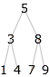

# tree-visualizer
A tree-visualizer for Racket programming language



## Installation
1. Copy `tree-visualizer.rkt` into the directory that contains your Racket files
2. Paste the following line at the top of your code:
```scheme
(require "tree-visualizer.rkt")
```

## Usage

```scheme
(visualize tree-type tree)
```
Prints a tree nicely in the interactive window.
- `tree-type` *Sym* - one of the following:  
    - `'binary-tree` - binary trees in the form of `(make-node key left right)`
    - `'cons-tree` - trees in the form of `(cons key (listof children)`
    - `'list-tree` - trees in the form of `(list key (listof children)`
    - `'struct-tree` - trees in the form of `(make-node key (listof children))`
- `tree` *(anyof binary-tree cons-tree list-tree struct-tree)* - a tree in one of the aforementioned forms

### Example
```scheme
TODO
```

## Developer Documentation
```scheme
(binary->generic tree)
;; binary-tree -> cons-tree
```
Converts a *binary-tree* to a generic tree.
- `tree` - a binary tree in the form of `(make-node key left right)`
<br><br>

```scheme
(cons->generic tree)
;; cons-tree -> cons-tree
```
Converts a *cons-tree* to a generic tree.
- `tree` - a tree in the form of `(cons key (listof children)`
<br><br>

```scheme
(list->generic tree)
;; list-tree -> cons-tree
```
Converts a *list-tree* to a generic tree.
- `tree` - a tree in the form of `(list key (listof children)`
<br><br>

```scheme
(struct->generic tree)
;; struct-tree -> cons-tree
```
Converts a *struct-tree* to a generic tree.
- `tree` - a tree in the form of `(make-node key (listof children))`
<br><br>

```scheme
(tree->tree-layout tree)
;; cons-tree -> tree-layout
```
Converts a generic tree to a *tree-layout* for printing.
- `tree` - a tree in the form of `(cons key (listof children)`
